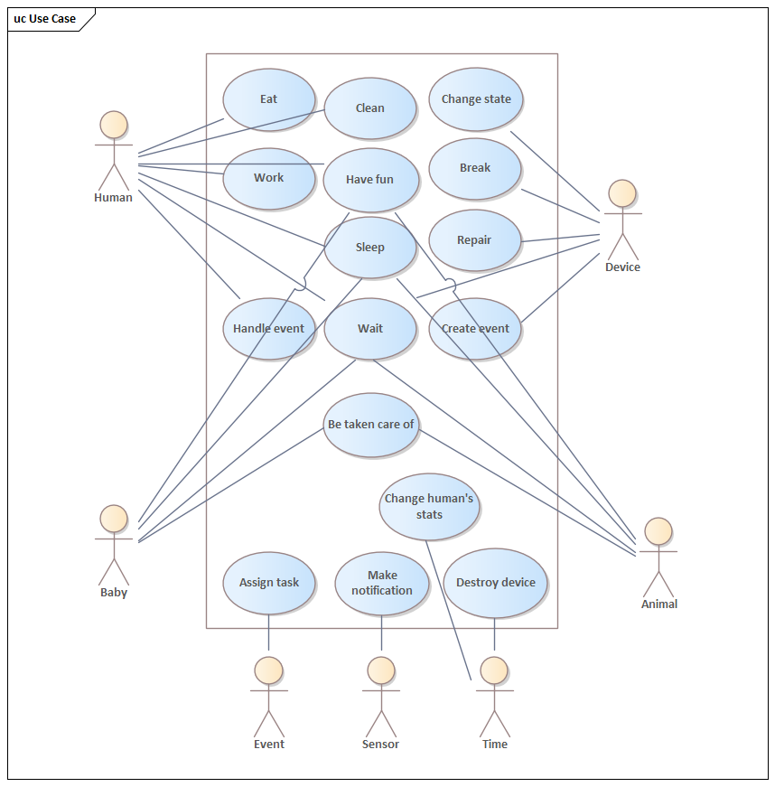

# OMO semestrální práce
_Arťom Ňorba, Jakub Ďuriš_
## Smart Home
Tématem naší semestrální práce je projekt Smart Home. Simulace probíhá ve třech různých obtížnostech, které určují startovní prostředky rodiny. Každému členovi domácnosti klesají statistiky, které poté vytváří
potřeby - hlad, únava, radost, čistota...  
Jednotlivé iterace probíhají po 10 minutách, kdy se ve třídě HouseController postupně zkontrolují všichni účastníci - lidé, zařízení... a přířadí se jim úkoly podle jejich potřeb a zařízení, se kterými budou v rámci tohoto úkolu pracovat.
Každé zařízení spotřebovává prostředky rodiny - vodu, elektřinu a používáním se opotřebovává. Po příliš velkém opotřebení se může zařízení rozbít a vyžaduje zásah člověka, aby bylo opět uvedeno do provozu. To proběhne buď opravou svépomocí, 
přivoláním opraváře nebo koupí nového kusu. Když člověk aktuálně nemá žádnou potřebu, hledá si libovolné volné zařízení, kterému se potom věnuje. Pokud není žádné volné zařízení, člověk čeká.  
Za nákup nových prostředků (voda, plyn, elektřina) se platí penězi, pokud rodině dojdou peníze, musí jít dospělá osoba pracovat k pracovnímu počítači, kde peníze vydělá.
Projekt je udělán se špetkou humoru, proto lidi můžou často něco říkat. Před spuštěním se samozřejmě dá nastavit jakou legendární hlášku entita vysloví.
### Seznam použitých design patternů:
 - **Iterator** - v package _iterator_ - iterátory použity při generaci reportů, kdy se prochází seznamem eventů a do souboru vypisují jednotlivé události.
 - **Factory** - v package _devices_ - zabalení vytváření nových instancí zařízení do příslušné metody
 - **Builder** - v package _house_ - slouži pro vytvoření domu při dodání podlaží, pokojů. 
 - **Strategy** - v package _strategy_ - vybírání obtížnosti počátečního nastavení domácnosti a jejích prostředků
 - **Singleton** - v package _location_ - každá lokalita se vytváří pouze jednou; není nutné mít např. dvakrát "outside"
 - **State** - v package _state_ - stejné metody pro ovládání device mají různý efekt v každém stavu device, např. když je zařízení ve stavu _off_, metoda _turnOffDevice_ nedělá nic
 - **Observer** - v package _observer_ - mění stavy zařízení na základě toho, ze kterého stavu zařízení do nového přechází
 - **Visitor** - v package _event_ - obsluhuje různé druhy eventů
 - **Lazy loading (virtual proxy)** - v package manuals - manuál ke každému zařízení se načte, až když ho člověk potřebuje
### Použití aplikace
 Simulace se spouští ve třídách EasyRun, MediumRun a HardRun, kde se dají vytvořit nová zařízení, rozmístit zařízení do pokojů po domě a přidat do domácnosti lidi. Dá se změnit i počet desetiminutových iterací, po které simulace poběží.
Reporty z běhu simulace se po proběhnutí vytváří a ukládají do složky reports. Obtížnosti se od sebe liší hlavně tím, kolik jednotek štěstí, hladu atd. se entitám ubírá při každém ticku. Také se při tžší obtížnosti více rozbíjejí zařízení a je náročnější je opravit. Na druhou stranu, čím lehčí je úroveň, tím kratší doba stačí uživatelům na použití deviců. V easy modu se žádný device nemůže rozbít!!!
### Class diagram

### Use Case diagram

